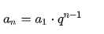
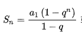
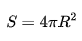
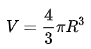

## 方程与不等式
**1.配方法**
```
根据公式 ax^2+bx+c=0;
1.提取a观察 b/2 => a(x^2+b/a)+c=0
2.则 a(x+b/2a)^2-k+c=0
```
  
## 数列
**1.等比数列的通项公式**



**2.等比数列的求和公式(利用S-S*q=a(1)-a(n+1))**


## 立体几何与平面几何
**1.半径是R的球的表面积计算公式是**



**2.半径是R的球的体积计算公式是**



## 平面几何解析
**1.圆的公式**   
**2.直线与圆的关系**

## 排列组合

**1.有15个商品每次拿5个参展，每两组之间至少有1个商品不同** 
> 答: 即求15取5的组合C(5,15)

**2.有五个老师分给四个班，每个班至少一名老师有几种分法** 
> 答: 即5选2的组合乘4的排列 C(2,5)*A(4,A)
